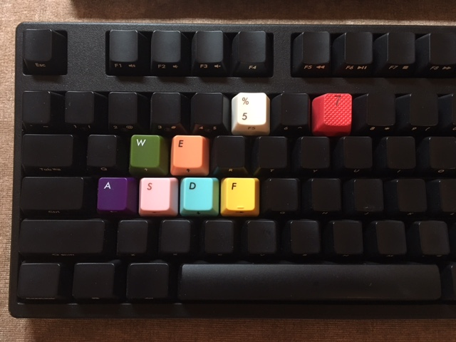
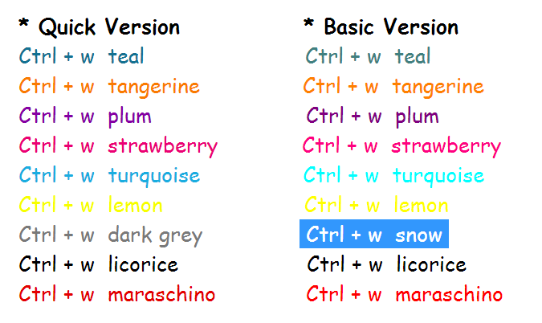

# Autohotkey Script for Evernote - Hotkeys for Font Color Change

Purpose
--------------
of this script is use "Win + Hotkey" to apply quick color switch. This is a very handy function for heavy note user. 

Heads up before usage
--------------
* I use Ctrl as a combination, though this key is widely used in many aspect, but in evernote you dont really need ctrl+s to save, and I have exchanged my cap key and ctrl key. I find it easier for my hand to touch.
* When I wrote this script, I get all positions in a single note window (not in evernote main window with side bars.) So the hotkeys are only available in single note window which you can pop from evernote main frame. If you want to use it in main frame too, don't hesitate to  adjust the script.
* MAC user can use Keyboard maestor as a substitute solution.
* Version of my evernote is 6.7.5. Evernote update may possibly effect the script. Because the script is simulating mouse click to change color. 
* Two versions are provided. In basic version, you can have a similar color pallet provided in MAC. Shorthand is it is slower than the quick version, becaue basic&custom pallet needs two clicks to pop. In quick version, you can use evernote color pallet by just one drop down click, then colors values are slightly differnt than basic values, but advantage is you get faster speed in switching color than basic version.
* If you are obsessed in color and has defined customed color value, please make sure you have a backup of color values, because evernote clear custom values from time to time. In my experience, when evernote upgrades, when you change your language settings etc... And you need to adjust script to use them.
* Have fun! I actually made literal changes to my HOT keys :)
  

Install Steps
--------------
* Install Autohotkey from [Autohotkey website](https://autohotkey.com/)
* Download file [evernote.basic.color.ahk](./evernote.basic.color.ahk) or [evernote.quick.color.ahk](./evernote.quick.color.ahk) to your PC and double click, an instance of autohotkey will run. 
* Now you can use the hotkeys. Pop your note from evernote, focus on the single note window and do your editing. 
* If you want some customized color other than predefined ones in evernote quick color pallet and basic color pallet, maintain them in custom color pallet. Then you need to adjust script to assign hotkey to certain click positions.

Key map defined in Script
--------------
  