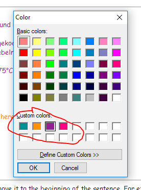

# Autohotkey Script for Evernote - Hotkeys for Font Color Change

Purpose of this script is use "Win + Hotkey" to apply quick color switch. This is a very handy function for heavy note user. Here are some heads up before you use it:
* Since a lot hotkey combination with "Ctrl" is reserved and widely accepted by windows users, I choose "Win" key for it's less popular.
* When I wrote this script, I get all positions in a single note window (not in evernote main window with side bars.) So the hotkeys are only available in single note window which you can pop from evernote main frame. If you want to use it in main frame too, don't hesitate to  adjust the script.
* Have fun!

Install Steps
--------------
* Install Autohotkey from [Autohotkey website](https://autohotkey.com/)
* If you want some customized color other than predefined ones in evernote, maintain them in color pallet. In my case, besides the basic colors, I steal some color names and definitions from MAC, and defined like this
  
* Download file [evernote.color.ahk](./evernote.color.ahk) to your PC and double click, an instance of autohotkey will run. 
* Now you can use the hotkeys. Pop your note from evernote, focus on the single note window and do your editing. The hotkeys are provided in following combinations. First 4 are my customized colors, and the rest are basic colors provided in evernote:
  * Win + w : teal
  * Win + e : tangerine
  * Win + a : plum
  * Win + s : stawberry
  * Win + d : turquoise
  * Win + f : lemon
  * Win + 5 : snow
  * Win + 6 : licorice
  * Win + 7 : maraschino
