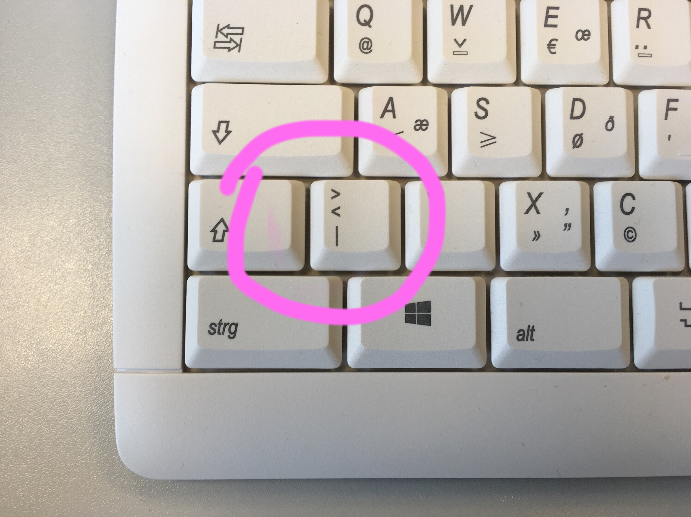
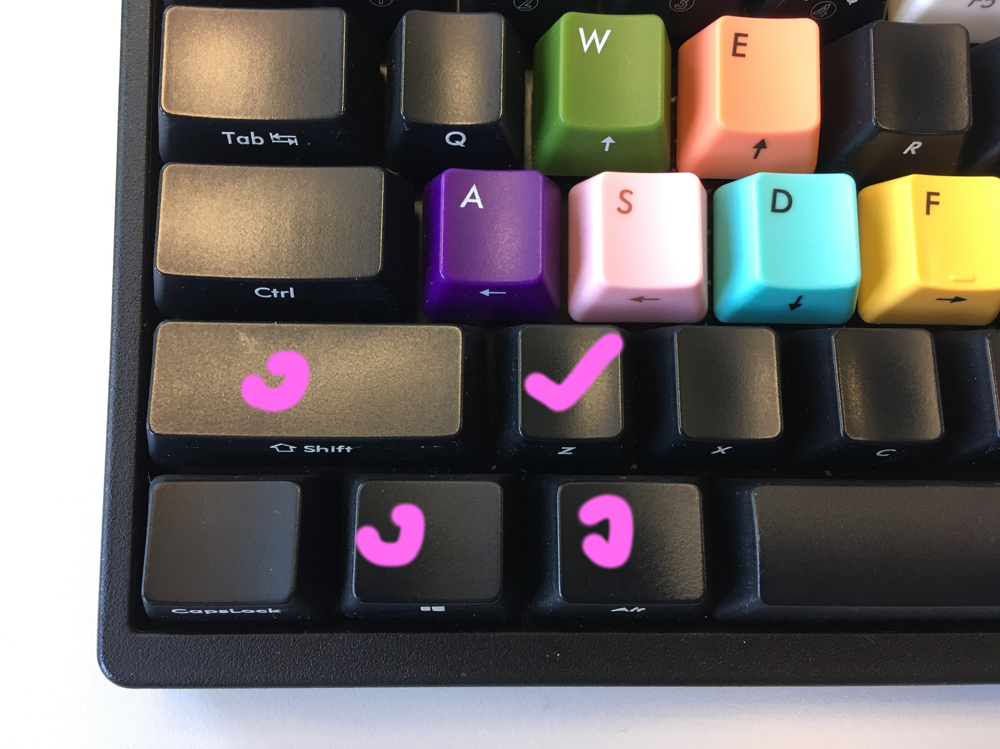

# Autohotkey Script for US International layout keyboard + DEU input method

Purpose
--------------
I have a US layout keyboard, but I need to type typical German umlaut like üöäß. German keyboard has an extra key right to left shift key which types "><|".  To type these impossible smbols (due to this missing key), I wrote this simple script. See following img. White deutsch keyboard has extra key which is highlighted, and I also marked the keys on black US keyboard I used to simulate this key.

Install Steps
--------------
* Install Autohotkey from [Autohotkey website](https://autohotkey.com/)
* Download file [uk.keyboard.for.de.input.method.ahk](./uk.keyboard.for.de.input.method.ahk) to your PC and double click, an instance of autohotkey will run. 
* Now you can use the hotkeys. 

Key map defined in Script
--------------

Keys | Output
--------- | --------
win + y  | <
win + shift + y  | > 
win + alt     | \|
